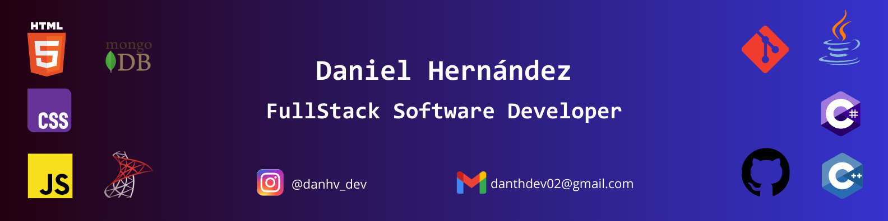

# Hello there, I'm Daniel 👋👨🏾‍💻

## About Me
I'm a FullStack development student 🤓.  
I've learned to develop web, desktop and mobile apps using various languages 👨🏾‍💻.  
Here you could find some of my homeworks and some projects I've done to pass the Specialized Technitian Software Apps Development course ✅.  

## Technologies 
Here are some of the technologies I use:  
     

<!--
**DanthvpDev/DanthvpDev** is a ✨ _special_ ✨ repository because its `README.md` (this file) appears on your GitHub profile.

Here are some ideas to get you started:

- 🔭 I’m currently working on ...
- 🌱 I’m currently learning ...
- 👯 I’m looking to collaborate on ...
- 🤔 I’m looking for help with ...
- 💬 Ask me about ...
- 📫 How to reach me: ...
- 😄 Pronouns: ...
- ⚡ Fun fact: ...
-->
